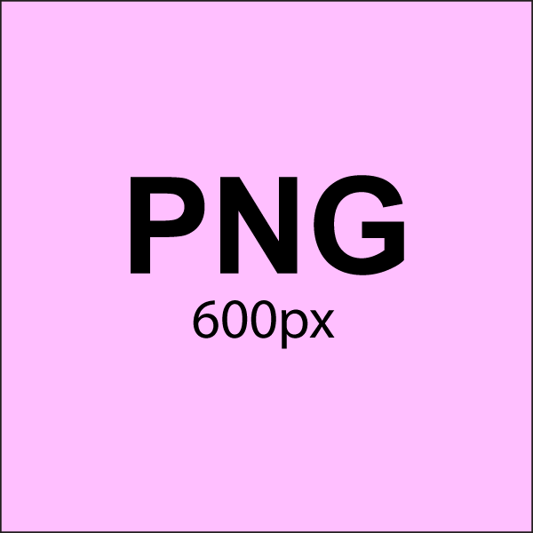
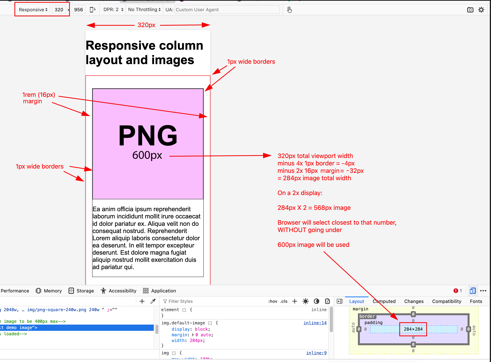
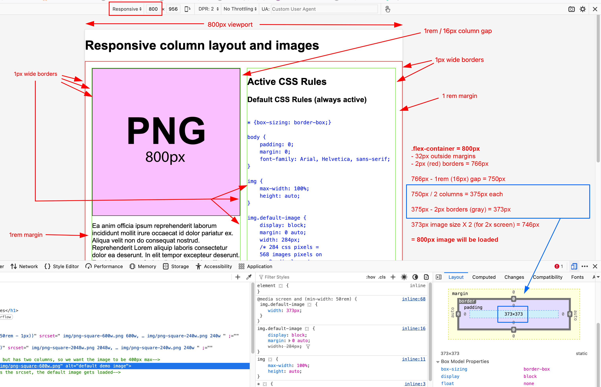

# Responsive multi-column web page layout with images

Demo for using column layout and HTML picture tags

## Please download the repo to see the HTML demo in action.

You can simply [download this entire repo as a zip archive](https://github.com/JACGWD/responsive-column-layout-and-images/archive/refs/heads/main.zip).

## Tips & Gotchas

### This section contains different tips & tricks that will help your responsiveness function properly.

#### 1. Using different image types?

##### Use "MIME Types" to identify the file format

If you use different file types (ex: jpg and svg), you will want to tell the browser which one is which within your picture tag. **The browser does not use the file extension for this.** It uses [MIME types](https://www.iana.org/assignments/media-types/media-types.xhtml#image).

|File Type|Mime Type|
|---|---|
|apng|image/apng|
|avif|image/avif|
|gif|image/gif|
|heic|image/heic|
|heif|image/heif|
|jpeg|image/jpeg|
|png|image/png|
|svg+xml|image/svg+xml|
|webp|image/webp|

**Important Note:** Always check to make sure web browsers support an image file type before using it. It is best to stick with well supported file types: apng (animated png), jpg, png, gif, svg and webp. For example [check the .heif page on caiuse.com](https://caniuse.com/heif)

##### Example Code

            <picture>
                <source
                media="(max-width: calc(50rem - 1px))"
                type="image/svg+xml"
                srcset="img/svg-square.svg 800w"
                sizes="calc(100vw - 2rem)">
                <!-- Note that since SVGs are resolution independent, we can say that the SVG is the same size as the box  -->

                <source
                media="(min-width: 50rem)"
                    type="image/png"
                    srcset="
                        img/png-square-600w.png 600w,
                        img/png-square-480w.png 480w,
                        img/png-square-240w.png 240w"
                sizes="23.3125rem">

                
                <!-- If the browser cannot process the srcset, the default image gets loaded -->
            </picture>    

##### Links

[https://developer.mozilla.org/en-US/docs/Web/Media/Guides/Formats/Image_types](https://developer.mozilla.org/en-US/docs/Web/Media/Guides/Formats/Image_types)

[https://developer.mozilla.org/en-US/docs/Web/HTTP/Guides/MIME_types](https://developer.mozilla.org/en-US/docs/Web/HTTP/Guides/MIME_types)

#### 2. Consider \<source> Order for Proper Rendering

When constructing \<picture> elements, it is crucial to remember the order of \<source> elements. **The browser will stop evaluating the remaining \<source> elements when it encounters one with a media attribute that evaluates to true.** Therefore, it is crucial to prioritize **media queries with higher specificity by placing them first**.

##### Example Code

        @media screen and (min-width: 50rem) and (orientation: portrait) {
            /* place longer/more specific media queries first */

            body {background-color: white;}

        }

        @media screen {
            /* place shorter/more general media queries last */

            body {background-color: blue;}
        }

#### 3. Understanding Border Box

##### 3.1 Without the CSS box-sizing property

By default, the width and height of an element is calculated like this:

- width + padding + border = actual width of an element
- height + padding + border = actual height of an element

##### 3.2 With the CSS box-sizing property

The **box-sizing** property allows us to include the padding and border in an element's total width and height.

See: [https://www.w3schools.com/csS/css3_box-sizing.asp](https://www.w3schools.com/csS/css3_box-sizing.asp)

#### 4. Understanding the image width for mobile

#### 5. Understanding the image width for desktop
        

        
    